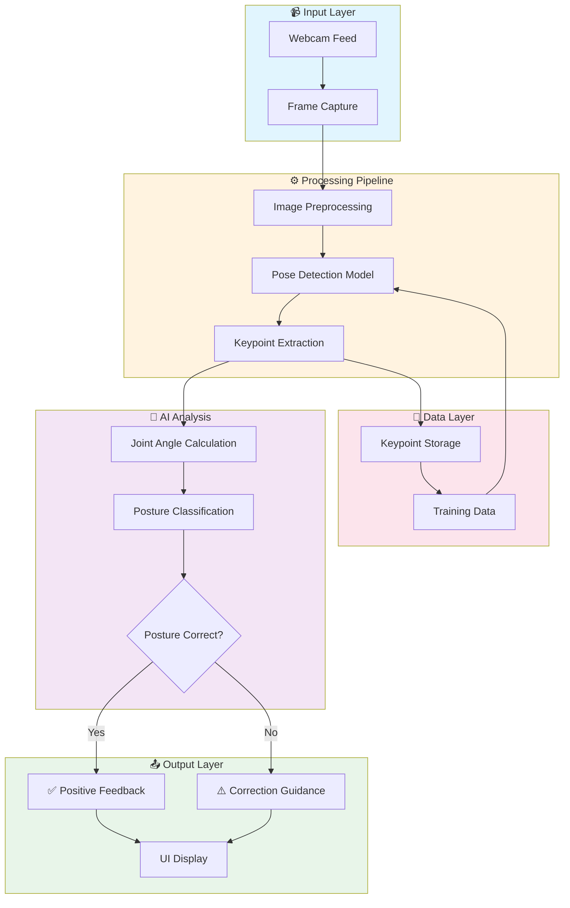

<div align="center">

# 🏋️ MoveUp-AI

**AI-Powered Posture Detection for Healthy Stretching**

[](https://python.org)
[](https://tensorflow.org)
[](LICENSE)
[]()

</div>

---

## 📖 About The Project

**MoveUp** is an intelligent AI web application that leverages real-time pose detection to help users perform upper body stretches correctly. The app guides users through essential back stretches while providing instant feedback on posture accuracy.

### 🎯 Mission

Reduce muscle tension for people who sit for long periods by making stretching **easy**, **safe**, and **accessible**.

### ✨ Key Features

| Feature                    | Description                                |
| -------------------------- | ------------------------------------------ |
| 🎥 **Real-time Detection** | Live webcam pose analysis using AI         |
| 📊 **Instant Feedback**    | Immediate correction suggestions           |
| 🧘 **Guided Stretches**    | Step-by-step stretching routines           |
| 📈 **Progress Tracking**   | Monitor your stretching consistency        |
| 🌐 **Web-Based**           | No installation required, works in browser |

---

## 🏗️ AI Architecture



---

## 📁 Project Structure

```
MoveUp-AI/
├── 📂 src/                      # Source code
│   ├── main.py                  # Main application entry
│   ├── video_record_pg.py       # Video recording module
│   └── data_transform.ipynb     # Data transformation notebook
├── 📂 data/                     # Data storage
│   ├── gif/                     # GIF demonstrations
│   ├── keypoint/                # Extracted keypoint data
│   └── video/                   # Training videos
├── 📂 utils/                    # Utility functions
├── 📄 requirements.txt          # Python dependencies
└── 📄 README.md                 # Project documentation
```

---

## 🚀 Implementation Roadmap

### Phase 1: Foundation _(Current)_

- [x] Project initialization and structure setup
- [x] Basic pose detection integration
- [x] Keypoint extraction module
- [ ] Video recording functionality

### Phase 2: Core Development

- [ ] Implement stretch detection algorithms
- [ ] Build posture classification model
- [ ] Create feedback generation system
- [ ] Develop web interface (Flask/FastAPI)

### Phase 3: User Interface

- [ ] Design responsive web UI
- [ ] Implement real-time video display
- [ ] Add visual feedback overlays
- [ ] Create stretch routine selection

### Phase 4: Enhancement

- [ ] Train custom ML model for accuracy
- [ ] Add multiple stretch routines
- [ ] Implement progress tracking
- [ ] Add audio guidance

### Phase 5: Deployment

- [ ] Optimize for performance
- [ ] Add user authentication
- [ ] Deploy to cloud platform
- [ ] Mobile responsiveness

---

## 🛠️ Tech Stack

| Category       | Technology                    |
| -------------- | ----------------------------- |
| **Backend**    | Python, Flask/FastAPI         |
| **AI/ML**      | TensorFlow, MediaPipe, OpenCV |
| **Frontend**   | HTML5, CSS3, JavaScript       |
| **Data**       | NumPy, Pandas                 |
| **Deployment** | Docker, Cloud Platform        |

---

## ⚡ Quick Start

### Prerequisites

- Python 3.8 or higher
- Webcam access
- Modern web browser

### Installation

1. **Clone the repository**

   ```bash
   git clone https://github.com/yourusername/MoveUp-AI.git
   cd MoveUp-AI
   ```

2. **Create virtual environment**

   ```bash
   python -m venv .venv
   source .venv/bin/activate  # On Windows: .venv\Scripts\activate
   ```

3. **Install dependencies**

   ```bash
   pip install -r requirements.txt
   ```

4. **Run the application**

   ```bash
   python src/main.py
   ```

5. **Open in browser**
   ```
   http://localhost:5000
   ```

---

## 🤝 Contributing

Contributions are welcome! Please feel free to submit a Pull Request.

1. Fork the Project
2. Create your Feature Branch (`git checkout -b feature/AmazingFeature`)
3. Commit your Changes (`git commit -m 'Add some AmazingFeature'`)
4. Push to the Branch (`git push origin feature/AmazingFeature`)
5. Open a Pull Request

---

## 📜 License

Distributed under the MIT License. See `LICENSE` for more information.

---

## 📧 Contact

Project Link: [https://github.com/yourusername/MoveUp-AI](https://github.com/yourusername/MoveUp-AI)

---

<div align="center">

**Made with ❤️ for healthier workdays**

</div>
